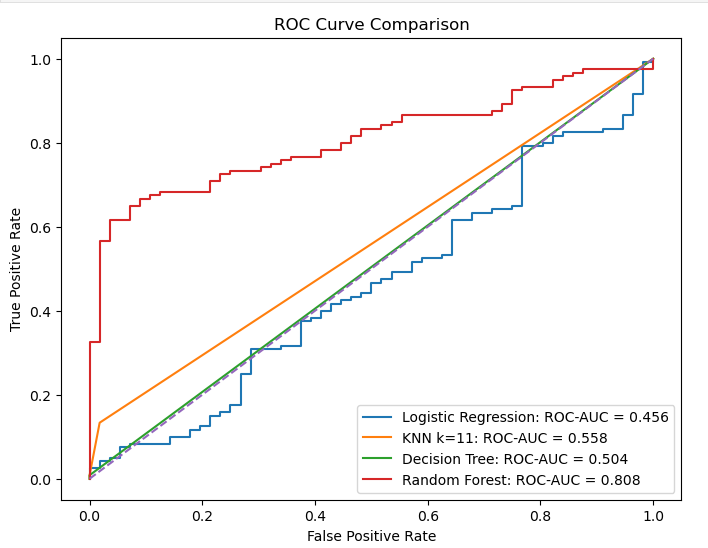
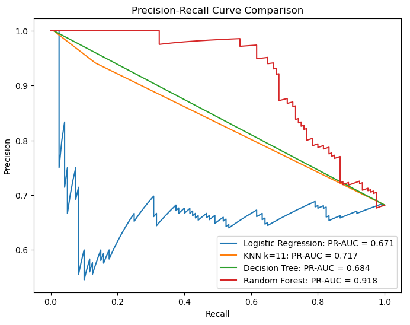
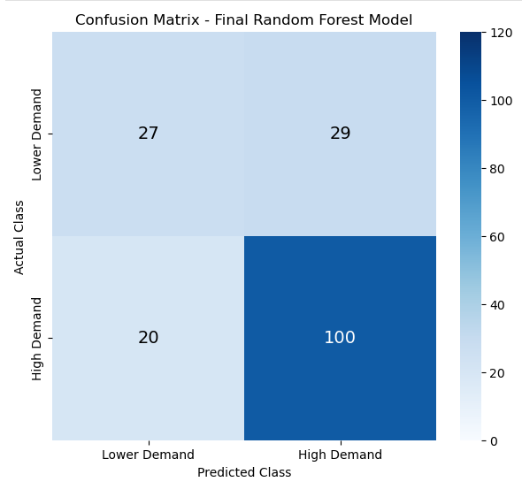
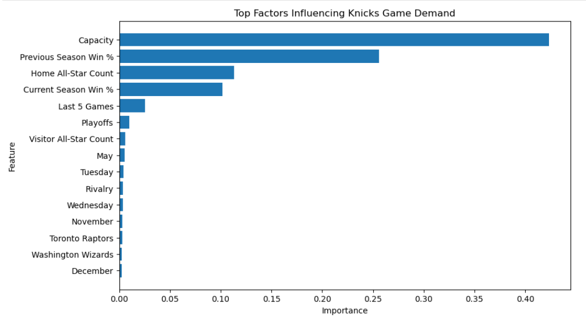

# NBA Game Demand Classification: Predicting High-Demand New York Knicks Home Games

## Project Overview

Professional sports organizations make critical business decisions before games are played, including ticket pricing, marketing campaigns, staffing levels, security planning, concessions management, and merchandise inventory allocation.

This project develops a machine learning classification framework to identify high-demand New York Knicks home games before they occur using historical attendance, team performance, scheduling, rivalry, playoff, and player star-power information.

Rather than predicting exact attendance figures, the objective is to identify games likely to generate exceptional fan demand and support proactive business decision-making.

---

# Business Problem

Demand for NBA games varies significantly depending on factors such as:

* Team performance
* Opponent popularity
* Rivalry matchups
* Playoff implications
* Scheduling effects
* Presence of star players

The challenge addressed in this project was:

> How can the New York Knicks identify high-demand home games before they occur so that revenue, marketing, and operational resources can be allocated more effectively?

Accurately identifying these games enables organizations to:

* Optimize ticket pricing strategies
* Allocate marketing resources efficiently
* Improve staffing and arena operations planning
* Manage concessions and merchandise inventory
* Enhance fan experience during peak-demand events

The resulting model functions as a decision-support tool rather than simply a predictive model.

---

# Dataset Summary

The project combines NBA game-level attendance data with NBA All-Star player information to create a comprehensive game-demand classification dataset.

| Metric                    | Value                |
| ------------------------- | -------------------- |
| Total NBA Games Available | 30,743               |
| Knicks Home Games Used    | 1,168                |
| Seasons Covered           | 1990–2019            |
| NBA All-Star Records      | 1,004                |
| Unit of Analysis          | One Knicks Home Game |

---

# Key Variables

### Attendance & Venue

* Attendance
* Arena Capacity

### Team Performance

* Current Win Percentage
* Previous Season Win Percentage
* Last Five Games Performance

### Scheduling Factors

* Day of Week
* Month
* Weekend Indicator

### Game Context

* Playoff Indicator
* Rivalry Indicator

### Opponent Information

* Visitor Team

### Star Power

* Home All-Star Count
* Visitor All-Star Count

---
## Data Preparation

The project combined game-level attendance data with player-level NBA All-Star data to create a predictive modeling dataset focused on New York Knicks home games.

Key preparation steps included:

* Filtering the dataset to New York Knicks home games across 30 NBA seasons (1990–2019)
* Aggregating player-level All-Star records into Home All-Star Count and Visitor All-Star Count features
* Merging attendance and All-Star datasets at the game level
* Creating occupancy rate and high-demand target variables
* Engineering performance, scheduling, and game-context features including Current Win %, Previous Season Win %, Last Five Games Performance, Playoffs, Rivalry, Day of Week, and Month
* Restricting model inputs to pre-game information to ensure realistic demand predictions and prevent data leakage
* Preparing a final classification-ready modeling dataset for machine learning analysis

# Target Variable Development

## Initial Approach

The project initially defined demand using arena occupancy rates.

**High Demand = Sold-Out Game (100% Occupancy)**

While this definition aligned with business intuition, exploratory analysis revealed that Knicks attendance was heavily concentrated near arena capacity.

As a result, occupancy-based demand labels provided limited separation between classes and reduced the ability of classification models to distinguish meaningful demand differences.

Initial model performance produced a ROC-AUC of approximately **0.61**.

---

## Refined Approach

Rather than focusing solely on model selection, the demand definition itself was re-evaluated.

The business objective was ultimately not to identify games that merely sold out, but rather to identify games that generated exceptional demand.

The target variable was therefore redefined as:

**High Demand = Top 10% Highest-Attendance Games**

This refinement created a more meaningful business forecasting problem and significantly improved model performance.

---

# Feature Engineering

Several business-oriented variables were incorporated to better capture factors influencing fan demand, including:

* Weekend Indicator
* Rivalry Indicator
* Playoff Indicator
* Home All-Star Count
* Visitor All-Star Count
* Team Performance Metrics

These variables were selected based on their potential influence on attendance behavior and game demand.

---

# Methodology

## Data Preparation

The following steps were performed:

* Data cleaning and validation
* Missing value assessment
* Feature engineering
* Target variable development
* Time-based train/test split

## Models Evaluated

The following classification models were compared:

* Logistic Regression
* K-Nearest Neighbors (KNN)
* Decision Tree
* Random Forest

## Evaluation Metrics

Models were evaluated using:

* Accuracy
* Precision
* Recall
* F1 Score
* ROC-AUC
* Precision-Recall AUC

Additional evaluation techniques included:

* Confusion Matrix Analysis
* Threshold Optimization
* Lift Analysis
* Cumulative Lift Analysis
* Feature Importance Analysis

---

# Model Selection

Multiple classification models were evaluated using a consistent performance framework.

Random Forest achieved the strongest overall performance and was selected as the final model.

---

# Final Model Performance

| Metric                   | Value |
| ------------------------ | ----- |
| ROC-AUC                  | 0.808 |
| Precision-Recall AUC     | 0.918 |
| Precision                | 0.775 |
| Recall                   | 0.833 |
| F1 Score                 | 0.803 |
| Classification Threshold | 0.30  |

The final model demonstrated strong ability to distinguish between high-demand and lower-demand games.

---

# Threshold Optimization

The default classification threshold of 0.50 was evaluated against alternative thresholds.

Threshold tuning identified **0.30** as the most effective operating threshold, improving the balance between precision and recall while maintaining strong overall predictive performance.

---

# Key Findings

Several factors were found to influence game demand:

* Opponent strength and popularity
* Presence of All-Star players
* Rivalry matchups
* Team performance
* Playoff implications
* Scheduling effects
* Arena capacity constraints

The strongest-performing model consistently leveraged a combination of team quality, star power, scheduling characteristics, and opponent information.

---

# Business Insight

The most important lesson from this project was not related to algorithm selection.

The largest improvement in predictive performance came from refining the business definition of demand rather than changing machine learning models.

By redefining demand from sold-out games to premium-demand games, the project created a more meaningful prediction task and substantially improved model performance.

This reinforces a core analytics principle:

> Better problem formulation often creates more value than greater model complexity.

---

# Business Applications

This model can help sports organizations:

* Forecast high-demand games before tickets go on sale
* Support dynamic ticket pricing decisions
* Improve marketing campaign planning
* Allocate staffing resources efficiently
* Optimize concessions and merchandise inventory
* Improve operational planning

The resulting framework provides actionable business insights that support proactive decision-making.

---

# Future Improvements

Potential future enhancements include:

* Weather data integration
* Historical ticket pricing information
* Player injury data
* Promotional campaign information
* Social media sentiment analysis
* Real-time fan engagement metrics

---

# Tools & Technologies

* Python
* Pandas
* Scikit-Learn
* Machine Learning
* Predictive Analytics
* Classification Modeling
* Matplotlib
* Seaborn
* Jupyter Notebook

---

## Model Performance

### ROC Curve Comparison

### Precision-Recall Curve Comparison

### Confusion Matrix

## Key Demand Drivers

### Feature Importance

